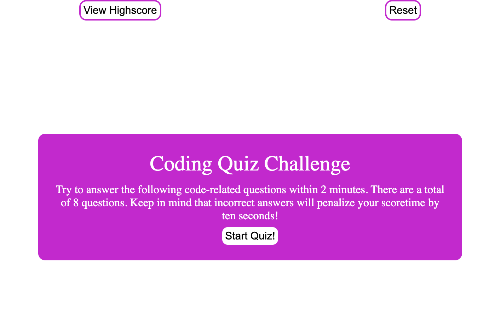
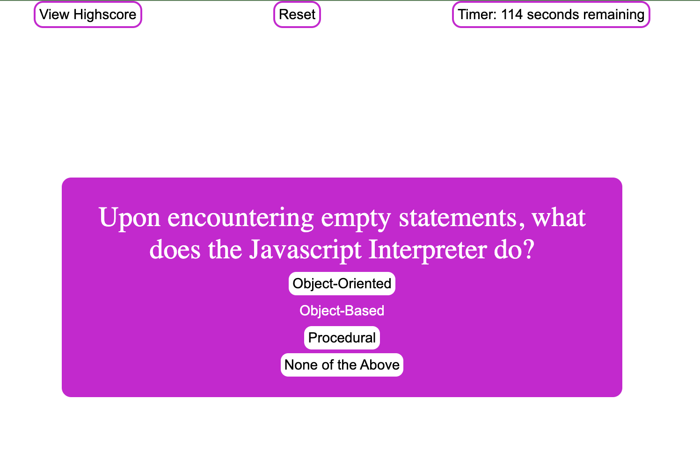
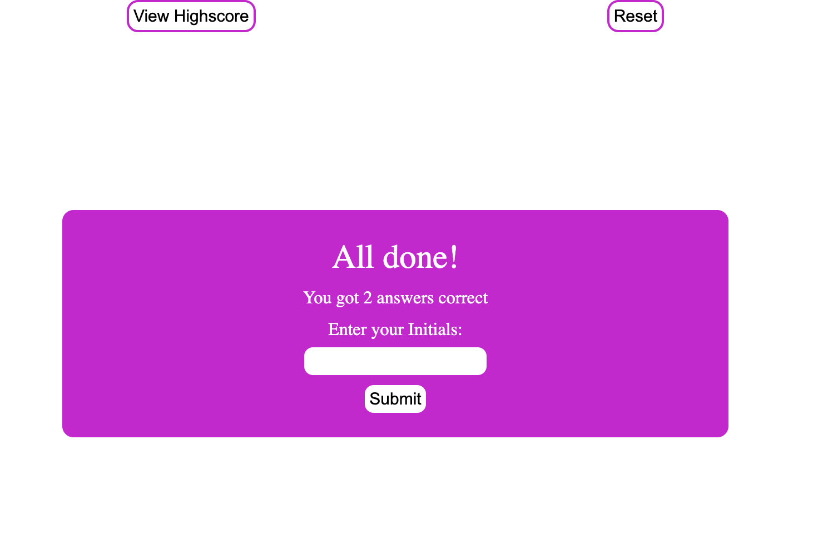
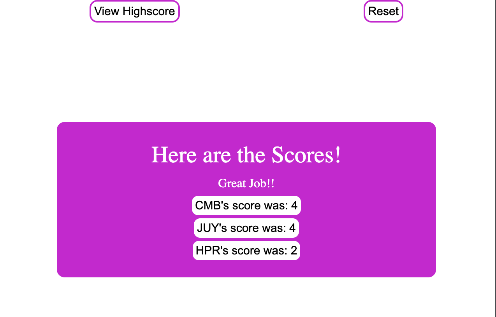

# Horiseon's Webpage

## Description:
A timed test where the user has 2 minutes to answer 8 questions and they get a score at the end of the test. They can post their score at the end of the test. They have the ability to start the test over and over again and take the test over again.

### Motivation:
Create  a questionaire about javascript, to test you knowledge of the users javascript. 

## Description

This project is a JavaScript-based quiz game that tests the user's knowledge of JavaScript concepts. The motivation behind building this project was to create an interactive and educational experience for users to learn and reinforce their understanding of JavaScript. The project solves the problem of engaging users in a fun and interactive way while learning JavaScript concepts.

The quiz consists of multiple-choice questions related to JavaScript. The user is presented with a question and four possible choices. The user selects an answer by clicking on one of the choices, and the program checks if the answer is correct. The user's score is incremented for each correct answer, and if the answer is incorrect, a penalty of 10 seconds is applied to the timer. The quiz is timed, and the user must complete it within a specified time limit. At the end of the quiz, the user's final score is displayed, and they have the option to submit their name and score to the high scores page.

Through this project, I learned how to dynamically generate and update HTML content using JavaScript. I also gained experience in handling user events, such as button clicks, and processing user input. Additionally, I learned how to implement a countdown timer and use local storage to store and retrieve data. Overall, this project allowed me to apply and enhance my JavaScript skills while creating an interactive quiz game.

## Installation

NA

## Usage

* This is the first prompt you are presented with.
*Once you click on the button the quiz beings  

* You are presented with the timer starting to countdown. There are a total of 8 questions. You have the option to reset the timer and start over and view highscores. 

* Here you are prompted to enter your initals and it will add your score and initals to the highscores list.

* This is the list of highscores from everyone played.

## Credits:
* Question source [https://www.includehelp.com/mcq/javascript-multiple-choice-questions-mcqs.aspx]
* W3Schools Javascript [https://www.w3schools.com/js/js_events.asp]

